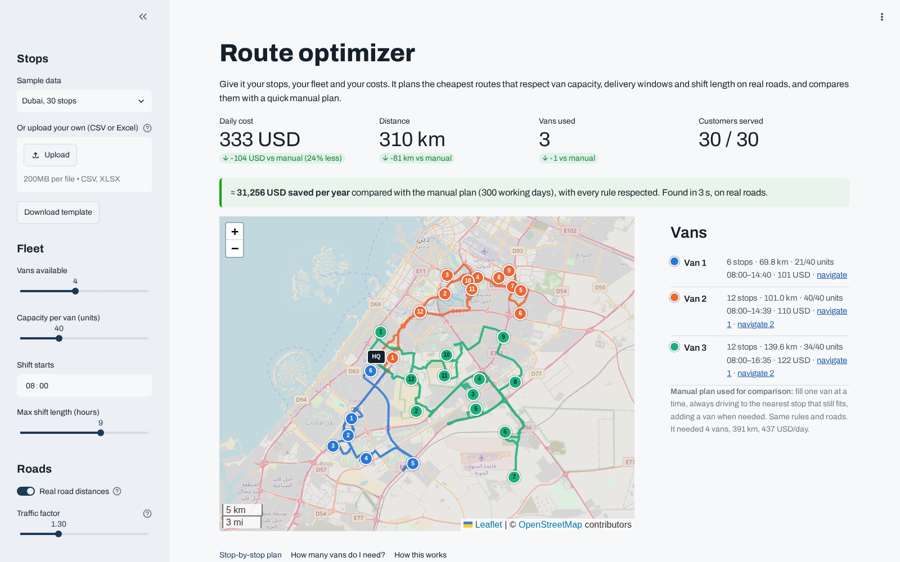

# Route optimizer

**Live demo:** https://slimaneoptic-routes.streamlit.app

Upload your delivery stops (CSV or Excel), set your fleet and your costs, and get the cheapest routes **on real roads** that respect van capacity, delivery time windows and shift length. Each plan is compared with a quick manual plan built from the same data, in km, vans and money.



On the included samples (real road distances, $0.30/km, $80 per van-day) the optimized plan costs **11–32% less per day** than the nearest-next-stop manual plan (about **$16k–31k a year**), drives 21–32% fewer km and often needs **one van less**, while serving every customer inside their window.

## What it handles
- **Real road distances and drive times** (OpenStreetMap / OSRM) with a traffic factor; routes drawn along the roads
- **Cost objective:** cost per km + daily cost per van, so it decides whether one more van pays off
- **Fleet sizing:** solves 1, 2, 3… vans to show the smallest fleet that serves everyone
- **Driver sheets:** Excel workbook with one sheet per van, arrival times, map links and Google Maps navigation

- Vehicle capacities (units, kg, pallets)
- Delivery time windows per customer (`HH:MM`)
- Service time per stop and maximum shift length
- Waiting when a van arrives early (up to 2 h)
- Stops that can't fit are flagged, not silently dropped
- Optional workload balancing between vans
- CSV in, CSV out, with a stop-by-stop plan and an interactive map

## Input format

| column           | required                 | example                  |
| ---------------- | ------------------------ | ------------------------ |
| name             | yes                      | `Customer 12`          |
| lat, lon         | yes                      | `33.5731`, `-7.5898` |
| demand           | no (default 1)           | `4`                    |
| tw_start, tw_end | no                       | `08:00`, `11:00`     |
| service_min      | no (default 5)           | `10`                   |
| depot            | no (first row otherwise) | `1` for the warehouse  |

## How it works

Google OR-Tools routing solver (guided local search) with capacity and time dimensions, minimizing daily cost. Road distances and times come from OSRM (OpenStreetMap); the 3 sample cities ship with precomputed road matrices, and uploads query OSRM live with a straight-line fallback.

## Run locally

```bash
pip install -r requirements.txt
streamlit run app.py
pytest -q tests   # checks capacity, time windows and shift limits on every sample
```

## Need this for your fleet?

Multiple depots, driver breaks, vehicle types, pickup & delivery, daily re-planning, and an API or Excel workflow your team already uses. I build these tools. https://www.upwork.com/freelancers/~01d6ae0f1a06a43ac0
